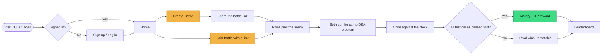
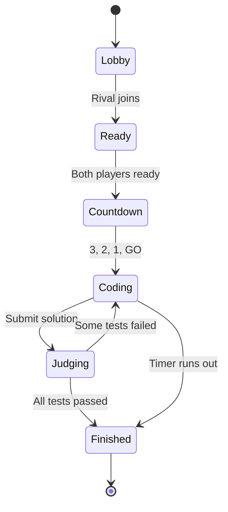
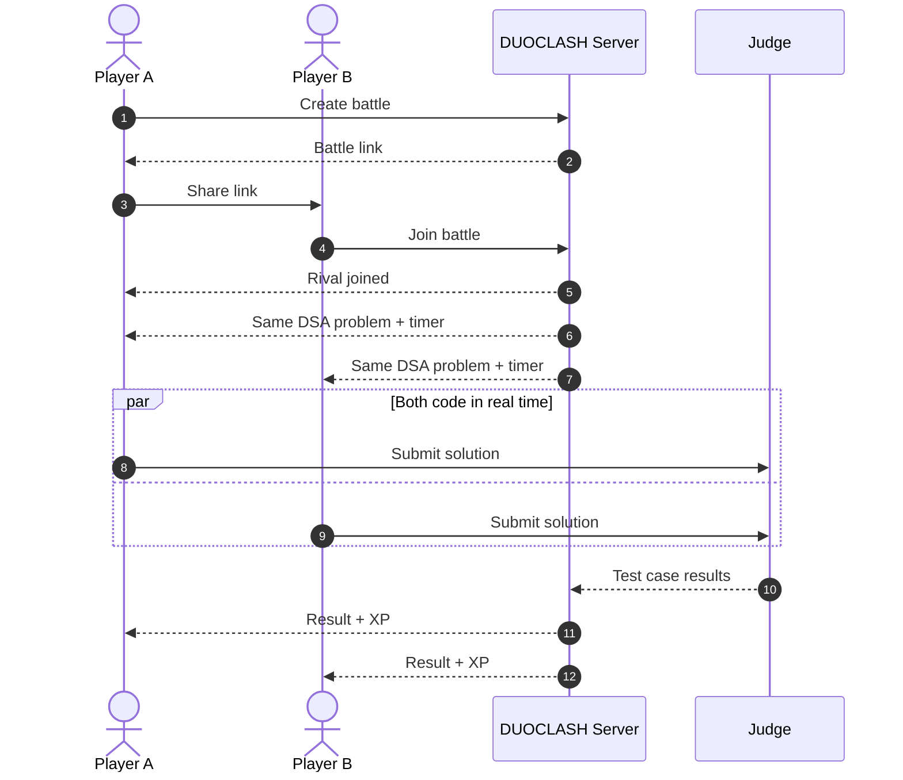
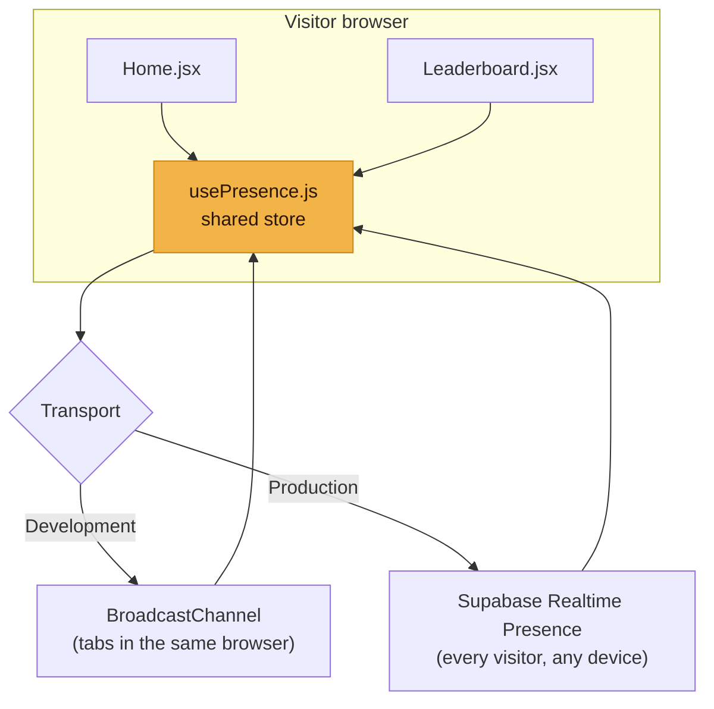

<div align="center">


<br />

<a href="https://github.com/Ruchitra-Jasmatiya/DuoClash">
  
</a>

<br />


**Challenge a friend. Get the same DSA problem. Race the clock. Claim the victory.**

[Preview](#-preview) • [Features](#-features) • [How It Works](#-how-it-works) • [Architecture](#-architecture) • [Getting Started](#-getting-started) • [Roadmap](#-roadmap)

</div>

---

## ⚔️ What is DUOCLASH?

**DUOCLASH** is a real-time, 1v1 **DSA coding battle arena**. Two players enter the same battleground, receive the **same data structures and algorithms problem**, and race to pass every test case first. Win battles to earn XP, climb the leaderboard, and build a **clan** with other students on campus.

> Practising DSA alone is slow. Practising it against a rival is addictive.

---

## 🖼️ Preview

<div align="center">


<sub>Fantasy battleground meets competitive coding: hero, How It Works journey, clan hub and Top Duelists.</sub>

</div>

---

## ✨ Features

| | Feature | Status |
|---|---|---|
| 🏰 | Cinematic fantasy landing page, fully responsive (desktop, tablet, mobile) | ✅ Done |
| 🧭 | **How It Works** journey with torn-parchment design and hover animations | ✅ Done |
| 🛡️ | **Clan hub** with a floating flag and a live online roster | ✅ Done |
| 🟢 | **Live presence**: see who is online and how many people are on the site | ✅ Done |
| 👑 | **Top Duelists** leaderboard preview | ✅ Done (static data) |
| ⚔️ | 1v1 battle rooms with shareable battle links | 🚧 In progress |
| ⏱️ | Same DSA problem for both players, live timer | 🚧 In progress |
| 🧪 | Code editor and automatic test-case judging | 🗺️ Planned |
| 🏆 | XP, ranks and rewards | 🗺️ Planned |
| 👥 | Create / join clans, clan battles | 🗺️ Planned |

---

## 🧭 How It Works



### Five simple steps

| Step | Title | What happens |
|:---:|---|---|
| **01** | Create / Join | Start a battle or join one using a battle link |
| **02** | Enter Battleground | Both players enter the same battle |
| **03** | Code & Solve | Solve the same DSA challenge against the clock |
| **04** | Defeat Your Rival | Complete the challenge and win the battle |
| **05** | Claim Your Reward | Victory unlocks your battle reward |

---

## 🔁 Battle Lifecycle



---

## 🏗️ Architecture

### Battle flow (target design)



### Live presence (already built)

The clan hub and the leaderboard share **one** presence store, so both always show the same people and the same count.



- **Signed-in users** appear by name with an *Online* or *In Battle* status.
- **Guests** are counted in the total ("12 online now · 3 guests") but are not listed.
- A shared store with a short grace period keeps people from flickering offline when they change pages.

---

## 🛠️ Tech Stack

| Layer | Tech |
|---|---|
| Frontend | React, Vite, React Router |
| Styling | Plain CSS (separate `Home.css`), no UI framework |
| Icons | [Lucide React](https://lucide.dev) |
| Realtime presence | BroadcastChannel (dev) and Supabase Realtime Presence (production) |
| Typography | Cinzel and Inter |

---

## 📁 Project Structure

> Folder names may differ slightly in your copy. Adjust to match.

```text
DuoClash/
├── docs/
│   ├── banner.svg               # README banner
│   └── preview.png              # design preview
├── public/
│   └── images/
│       └── clan-flag.png        # your clan flag artwork
├── src/
│   ├── assets/
│   │   └── images/
│   │       └── background.png   # full-page HD background
│   ├── Home.jsx                 # landing page
│   ├── Home.css                 # landing page styles
│   ├── usePresence.js           # shared "who is online" store
│   ├── presenceSupabase.js      # real cross-device presence adapter
│   ├── Battle.jsx               # battle arena (in progress)
│   ├── Leaderboard.jsx          # leaderboard (in progress)
│   └── main.jsx
├── index.html
├── package.json
└── README.md
```

---

## 🚀 Getting Started

### Prerequisites

- [Node.js](https://nodejs.org) 18 or newer
- npm

### Install and run

```bash
# 1. Clone
git clone https://github.com/Ruchitra-Jasmatiya/DuoClash.git
cd DuoClash

# 2. Install dependencies
npm install

# 3. Start the dev server
npm run dev
```

Open **http://localhost:5173** in your browser.

### Add your artwork

| What | Where |
|---|---|
| Full-page background (HD) | `src/assets/images/background.png` (any file under `src/assets` with "background" in its name works) |
| Clan flag | `public/images/clan-flag.png` |

### Test live presence on your machine

Open two tabs, then add `?as=Name` to each URL (development mode only):

```text
http://localhost:5173/?as=Sakshi
http://localhost:5173/?as=Gautam
```

Both names appear in the clan hub's online list, and the count goes up.

### Turn on real presence for every visitor (optional)

```bash
npm i @supabase/supabase-js
```

Create a `.env` file:

```env
VITE_SUPABASE_URL=https://your-project.supabase.co
VITE_SUPABASE_ANON_KEY=your-anon-key
```

Then in `main.jsx`, before rendering the app:

```jsx
import { setPresenceTransport } from './usePresence';
import { createSupabaseTransport } from './presenceSupabase';

setPresenceTransport(
  createSupabaseTransport({
    url: import.meta.env.VITE_SUPABASE_URL,
    anonKey: import.meta.env.VITE_SUPABASE_ANON_KEY,
  })
);
```

> No database table is needed. Supabase Realtime Presence handles it.

---

## 🎨 Design System

Warm gold for battle actions, deep green for join actions, navy for panels and cream parchment for the journey. The background image does the fantasy heavy lifting, and the UI stays clean on top.

| Role | Colour | Hex |
|---|---|---|
| Battle action |  Gold | `#f2b447` |
| Primary button |  Orange | `#f08a1f` |
| Join action |  Deep green | `#1c7a4f` |
| Panels |  Navy | `#121c42` |
| Parchment |  Cream | `#f2e4c4` |
| Online |  Green | `#3ddc84` |

---

## 🗺️ Roadmap

- [x] Responsive landing page with cinematic background
- [x] How It Works journey, clan hub and Top Duelists
- [x] Live presence (online roster and visitor count)
- [ ] Authentication (sign up / log in)
- [ ] Battle rooms with shareable links
- [ ] Real-time code editor and synchronized timer
- [ ] Automatic judging with test cases
- [ ] XP, ranks and rewards
- [ ] Real leaderboard connected to the database
- [ ] Create and join clans, clan vs clan battles
- [ ] Problem library by topic and difficulty

---

## 🤝 Contributing

Contributions are welcome.

1. Fork the repo
2. Create a branch: `git checkout -b feature/amazing-feature`
3. Commit your changes: `git commit -m "Add amazing feature"`
4. Push: `git push origin feature/amazing-feature`
5. Open a Pull Request

---

## 📜 License

Distributed under the **MIT License**. See `LICENSE` for details.

---

## 👩‍💻 Author

**Ruchitra Jasmatiya**
GitHub: [@Ruchitra-Jasmatiya](https://github.com/Ruchitra-Jasmatiya)

---

<div align="center">

### ⚔️ Two minds. One battle. May the best coder win. ⚔️

If you like this project, give it a ⭐

</div>