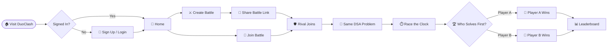
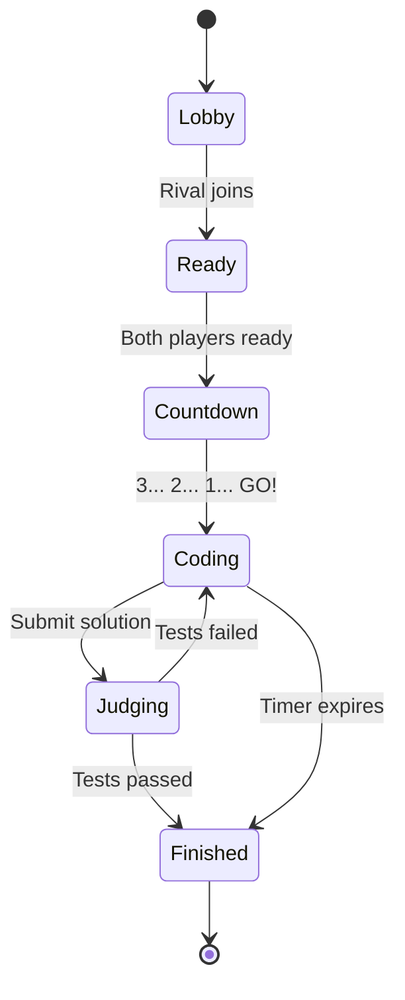
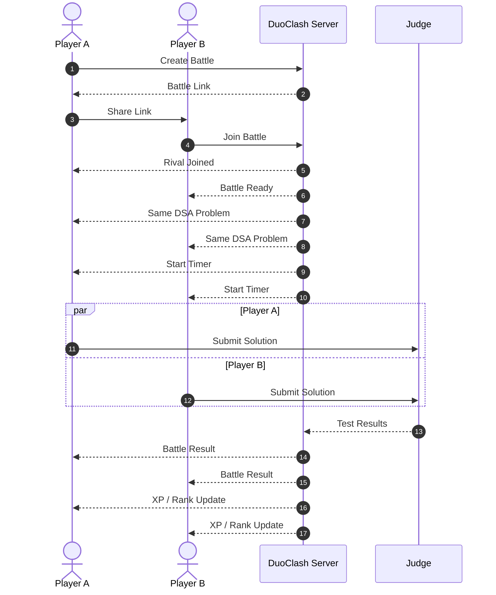
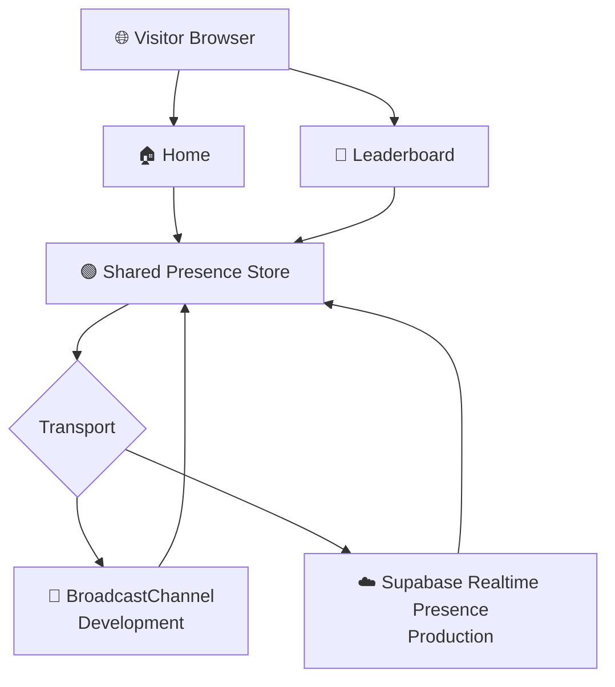

<div align="center">

<!-- HERO -->


<br />

# ⚔️ DUOCLASH

### **Two Minds. One Battle.**

**Challenge a friend. Get the same DSA problem. Race the clock. Claim the victory.**

<br />

<a href="https://github.com/Ruchitra-Jasmatiya/DuoClash">

</a>

<br /><br />


<br />


<br /><br />

<a href="#-preview">Preview</a> • <a href="#-features">Features</a> • <a href="#-how-it-works">How It Works</a> • <a href="#-architecture">Architecture</a> • <a href="#-getting-started">Getting Started</a> • <a href="#-roadmap">Roadmap</a>

</div>

---

# ⚔️ What is DUOCLASH?

**DuoClash** is a competitive **1v1 DSA coding battle platform** designed to turn traditional DSA practice into an interactive and competitive experience.

Two players enter the same battleground, receive the **same programming challenge**, and race against the clock to solve it.

Instead of practising DSA alone, DuoClash adds:

* ⚔️ Head-to-head competition
* 🧠 Real problem-solving pressure
* ⏱️ Time-based challenges
* 🏆 Competitive progression
* 👥 Social and clan-based interaction
* 📊 Leaderboard-driven motivation

> **Practising DSA alone is preparation. Practising it against a rival is a battle.**

---

# 🏰 The Idea Behind DuoClash

Traditional DSA preparation can become repetitive:

```text
Open Problem
     ↓
Solve
     ↓
Check Answer
     ↓
Next Problem
     ↓
Repeat...
```

DuoClash changes the experience:

```text
        ⚔️ DUOCLASH
             │
       ┌─────┴─────┐
       │           │
    Player A    Player B
       │           │
       └─────┬─────┘
             ↓
      Same DSA Problem
             ↓
        Race the Clock
             ↓
       Submit Solution
             ↓
      🏆 Battle Result
             ↓
       XP / Leaderboard
```

The goal is simple:

### **Make DSA practice feel like a game.**

---

# 🖼️ Preview

<div align="center">


<br /><br />

<i>Fantasy battleground meets competitive programming.</i>

</div>

> **Tip:** Keep `preview.png` inside the repository at `docs/preview.png`.
> GitHub renders local repository images more reliably than random image-hosting URLs.

---

# ✨ Features

|     | Feature                                      |     Status     |
| --- | -------------------------------------------- | :------------: |
| 🏰  | Cinematic fantasy landing page               |     ✅ Done     |
| 📱  | Responsive desktop, tablet and mobile design |     ✅ Done     |
| 🧭  | Interactive How It Works journey             |     ✅ Done     |
| 🛡️ | Clan hub with floating clan flag             |     ✅ Done     |
| 🟢  | Live online presence                         |     ✅ Done     |
| 👑  | Top Duelists leaderboard preview             |     ✅ Done     |
| ⚔️  | 1v1 battle rooms                             | 🚧 In Progress |
| 🔗  | Shareable battle links                       | 🚧 In Progress |
| ⏱️  | Synchronized battle timer                    | 🚧 In Progress |
| 🧠  | Same DSA problem for both players            | 🚧 In Progress |
| 🧪  | Code editor and automatic judging            |   🗺️ Planned  |
| 🏆  | XP, ranks and rewards                        |   🗺️ Planned  |
| 👥  | Create and join clans                        |   🗺️ Planned  |
| ⚔️  | Clan vs Clan battles                         |   🗺️ Planned  |
| 📚  | DSA problem library                          |   🗺️ Planned  |

---

# 🧭 How It Works



---

# 🗡️ Five Steps to Victory

|  Step  | Stage                 | What Happens                               |
| :----: | --------------------- | ------------------------------------------ |
| **01** | 🏰 Create / Join      | Start a battle or join using a battle link |
| **02** | ⚔️ Enter Battleground | Both players enter the same arena          |
| **03** | 🧠 Code & Solve       | Solve the same DSA challenge               |
| **04** | ⏱️ Race the Clock     | Submit before your rival                   |
| **05** | 🏆 Claim Victory      | Win the battle and progress                |

---

# 🔁 Battle Lifecycle



---

# 🏗️ Architecture

## ⚔️ Target Battle Architecture



---

# 🟢 Live Presence

DuoClash currently uses a shared presence system for the clan hub and leaderboard experience.



### Presence behaviour

* 🟢 Signed-in users can appear in the online roster.
* ⚔️ Users can be represented with an active battle state.
* 👤 Guests can contribute to the visitor count.
* 🔄 Shared presence reduces unnecessary online/offline flickering while navigating.

---

# 🎮 DuoClash Experience

```text
┌──────────────────────────────────────────────┐
│                 DUOCLASH                     │
│                                              │
│          ⚔️ TWO MINDS. ONE BATTLE.          │
│                                              │
│   ┌────────────┐       ┌────────────┐       │
│   │  PLAYER A  │       │  PLAYER B  │       │
│   │    🧑‍💻     │  VS   │    👨‍💻     │       │
│   └────────────┘       └────────────┘       │
│                                              │
│        🧠 SAME DSA CHALLENGE                │
│                                              │
│             ⏱️ 09:42                        │
│                                              │
│        [       CODE HERE       ]             │
│                                              │
│             [ SUBMIT ⚔️ ]                   │
│                                              │
└──────────────────────────────────────────────┘
```

---

# 🛠️ Tech Stack

| Layer                | Technology                           |
| -------------------- | ------------------------------------ |
| ⚛️ Frontend          | React                                |
| ⚡ Build Tool         | Vite                                 |
| 🧭 Routing           | React Router                         |
| 🎨 Styling           | Plain CSS                            |
| 🖼️ UI Icons         | Lucide React                         |
| 🟢 Realtime Presence | BroadcastChannel + Supabase Realtime |
| 🔤 Typography        | Cinzel + Inter                       |
| ☁️ Future Backend    | Supabase / Realtime services         |

---

# 📁 Project Structure

```text
DuoClash/
│
├── docs/
│   ├── banner.svg
│   └── preview.png
│
├── public/
│   └── images/
│       └── clan-flag.png
│
├── src/
│   ├── assets/
│   │   └── images/
│   │       └── background.png
│   │
│   ├── Home.jsx
│   ├── Home.css
│   ├── usePresence.js
│   ├── presenceSupabase.js
│   ├── Battle.jsx
│   ├── Leaderboard.jsx
│   └── main.jsx
│
├── index.html
├── package.json
├── README.md
└── LICENSE
```

> Folder names can change as the project grows. Update this section whenever the architecture changes.

---

# 🚀 Getting Started

## Prerequisites

* Node.js 18+
* npm
* Git

## Clone the repository

```bash
git clone https://github.com/Ruchitra-Jasmatiya/DuoClash.git

cd DuoClash
```

## Install dependencies

```bash
npm install
```

## Start development server

```bash
npm run dev
```

Then open:

```text
http://localhost:5173
```

---

# 🖼️ Project Artwork

Keep the visual assets inside the repository instead of relying on external image URLs.

| Asset                   | Location                           |
| ----------------------- | ---------------------------------- |
| 🏰 README Banner        | `docs/banner.svg`                  |
| 🖼️ Application Preview | `docs/preview.png`                 |
| 🏳️ Clan Flag           | `public/images/clan-flag.png`      |
| 🌌 Background           | `src/assets/images/background.png` |

This makes the README more reliable when viewed from GitHub.

---

# 🟢 Testing Live Presence

During development, open two browser tabs:

```text
http://localhost:5173/?as=Sakshi
```

and

```text
http://localhost:5173/?as=Gautam
```

The development presence transport can then be used to test multiple visitors/tabs.

---

# ☁️ Supabase Realtime Setup

To enable the production presence transport:

```bash
npm install @supabase/supabase-js
```

Create:

```text
.env
```

Add:

```env
VITE_SUPABASE_URL=https://your-project.supabase.co
VITE_SUPABASE_ANON_KEY=your-anon-key
```

Then configure the presence transport in your application:

```jsx
import { setPresenceTransport } from "./usePresence";
import { createSupabaseTransport } from "./presenceSupabase";

setPresenceTransport(
  createSupabaseTransport({
    url: import.meta.env.VITE_SUPABASE_URL,
    anonKey: import.meta.env.VITE_SUPABASE_ANON_KEY,
  })
);
```

> Supabase Realtime Presence can manage presence state without requiring a traditional database table for the presence list.

---

# 🎨 Design System

DuoClash uses a fantasy-inspired competitive coding theme.

| Role              | Colour     | Hex       |
| ----------------- | ---------- | --------- |
| ⚔️ Battle Action  | Gold       | `#F2B447` |
| 🔥 Primary Action | Orange     | `#F08A1F` |
| 🟢 Join Action    | Deep Green | `#1C7A4F` |
| 🌌 Panels         | Navy       | `#121C42` |
| 📜 Parchment      | Cream      | `#F2E4C4` |
| 🟢 Online         | Green      | `#3DDC84` |

### Visual direction

```text
Fantasy
   +
Competitive Programming
   +
Game Interface
   +
Clean Modern UI
        ↓
     DUOCLASH
```

---

# 🗺️ Roadmap

### 🏰 Foundation

* [x] Responsive landing page
* [x] Cinematic fantasy background
* [x] How It Works section
* [x] Clan hub
* [x] Top Duelists section
* [x] Live presence

### ⚔️ Battle System

* [ ] Authentication
* [ ] Create battle
* [ ] Join battle
* [ ] Shareable battle links
* [ ] Battle lobby
* [ ] Synchronized timer
* [ ] Same problem for both players

### 🧠 Coding System

* [ ] Integrated code editor
* [ ] Multiple test cases
* [ ] Automatic code execution
* [ ] Test-case judging
* [ ] Submission history
* [ ] Problem difficulty levels

### 🏆 Gamification

* [ ] XP system
* [ ] Player ranks
* [ ] Battle rewards
* [ ] Win / loss statistics
* [ ] Global leaderboard
* [ ] Achievements

### 👥 Clan System

* [ ] Create clans
* [ ] Join clans
* [ ] Clan profiles
* [ ] Clan rankings
* [ ] Clan vs Clan battles

### 📚 DSA Library

* [ ] Arrays
* [ ] Strings
* [ ] Searching
* [ ] Sorting
* [ ] Linked Lists
* [ ] Stack & Queue
* [ ] Trees
* [ ] Graphs
* [ ] Dynamic Programming

---

# 📊 Future Player Progression

```text
              🏆
         GRAND DUELIST
              ▲
              │
          MASTER
              ▲
              │
           ELITE
              ▲
              │
          WARRIOR
              ▲
              │
          ROOKIE
              ▲
              │
        ⚔️ FIRST BATTLE
```

Players will eventually be able to build their competitive profile through battles, XP, ranks and leaderboard progression.

---

# 🤝 Contributing

Contributions are welcome.

### 1. Fork the repository

### 2. Create a feature branch

```bash
git checkout -b feature/amazing-feature
```

### 3. Commit your changes

```bash
git add .
git commit -m "Add amazing feature"
```

### 4. Push the branch

```bash
git push origin feature/amazing-feature
```

### 5. Open a Pull Request

Describe what you changed and why.

---

# 📜 License

Distributed under the **MIT License**.

See the `LICENSE` file for details.

---

# 👩‍💻 Author

<div align="center">

### Ruchitra Jasmatiya

<a href="https://github.com/Ruchitra-Jasmatiya">

</a>

</div>

---

<div align="center">

<br />

# ⚔️ TWO MINDS. ONE BATTLE.

### **May the best coder win.**

<br />


<br /><br />

⭐ **If you like DuoClash, consider starring the repository.**

</div>
